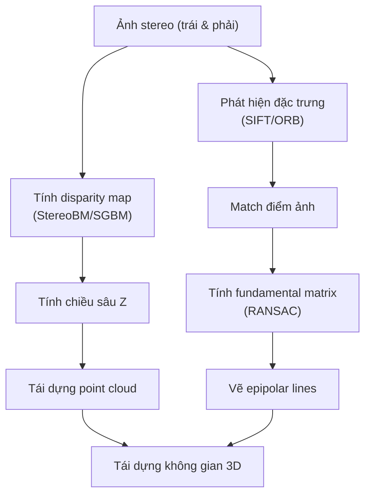

# 3D Reconstruction from Stereo Images

## Install

```sh
# tạo môi trường ảo
python -m venv 3drecon
# source venv/bin/activate
source 3drecon/Scripts/activate
# deactivate

# Cài đặt ipykernel và jupyter
pip install ipykernel jupyter

# B4. Đăng ký venv như một kernel riêng biệt
python -m ipykernel install --user --name=3drecon --display-name "Python (3drecon)"

# run jupyter notebook
```

## Flow



## Kiến thức nền cần nắm

### Stereo images (ảnh stereo)

Hai ảnh của cùng một cảnh được chụp bởi hai camera hoặc một camera dịch ngang. Ví dụ: mắt trái và mắt phải nhìn một vật.

Nguồn ảnh:
- https://vision.middlebury.edu/stereo/data/
- https://vision.middlebury.edu/stereo/data/scenes2003/newdata/teddy/

### Disparity Map (bản đồ chênh lệch)

- Mỗi pixel trong ảnh trái sẽ có một pixel tương ứng trong ảnh phải.
- Disparity là độ lệch ngang (trên trục X) giữa vị trí của cùng một điểm trong ảnh trái và phải.
- Disparity càng lớn (màu sáng) ⇒ vật càng gần (màu tối) (giống nguyên lý mắt người).

Được tính bằng:
- **BM (Block Matching)**: tìm khối nhỏ giống nhau giữa 2 ảnh
- **SGBM (Semi-Global Block Matching)**: thuật toán cải tiến, mượt hơn, chính xác hơn block matching

### 3D Point Cloud (đám mây điểm 3D)

Sau khi có disparity, dùng công thức:

```math
Z = \frac{f \cdot B}{d}
```

Trong đó:
- Z: chiều sâu (depth)
- f: tiêu cự (focal length)
- B: khoảng cách 2 camera (baseline)
- d: disparity

Dựng các tọa độ (X, Y, Z) cho từng điểm ảnh, tạo thành **point cloud** – một tập hợp các điểm trong không gian 3D.

### Fundamental Matrix (ma trận cơ sở)

Là ma trận 3×3 mô tả mối liên hệ hình học giữa ảnh trái và phải.

Nếu một điểm x ở ảnh trái và x' ở ảnh phải tương ứng, thì:
```math
x'^T \cdot F \cdot x = 0
```

Dùng để tính và vẽ **epipolar lines**.

### Epipolar Lines (đường tịnh tiến)

- Cho 1 điểm trên ảnh trái, **epipolar line** là đường thẳng trên ảnh phải mà điểm tương ứng bắt buộc phải nằm trên đó.
- Ngược lại cũng đúng: từ ảnh phải → ảnh trái.

📌 Epipolar lines giúp giới hạn không gian tìm kiếm khi so khớp điểm giữa 2 ảnh.

### Texture (kết cấu bề mặt)

Đặc trưng bề mặt của vật thể, giúp nhận diện và phân biệt các vật thể khác nhau, phản ánh họa tiết, mẫu lặp, độ thô ráp, hoặc đặc tính bề mặt của đối tượng.

Texture được định nghĩa bởi các yếu tố như:
- Tần suất và mức độ lặp lại của mẫu (pattern)
- Biến thiên cường độ pixel (local variations)
- Độ hạt (coarseness): mịn hay thô
- Hướng tính (directionality): có xu hướng một chiều hay hỗn loạn

🔍 Ứng dụng của texture
- Nhận dạng vật thể (ví dụ: phân biệt da người và gỗ)
- Phân đoạn ảnh (ví dụ: chia vùng mịn – thô)
- Nhận diện bề mặt (3D reconstruction)
- Tổng hợp hình ảnh (image synthesis)
- Nhận diện khuôn mặt, vân tay...

### Lý do sử dụng ảnh grayscale

Sử dụng grayscale thay vì ảnh màu (rgb) trong bài toán stereo vision có lý do chính sau:

1. Đơn giản hóa tính toán:
Stereo vision dựa trên việc so sánh các pixel tương ứng giữa hai ảnh (trái và phải) để tính toán độ chênh lệch (disparity). Ảnh grayscale chỉ có một kênh (intensity), giúp giảm độ phức tạp và thời gian xử lý so với ảnh màu (RGB), vốn có ba kênh.

2. Không cần thông tin màu sắc:
Thông tin màu sắc không cần thiết trong việc tính toán disparity map. Điều quan trọng là sự tương đồng về cường độ sáng giữa các pixel tương ứng.

3. Giảm nhiễu:
Ảnh màu có thể chứa nhiều nhiễu hơn do sự khác biệt giữa các kênh màu. Chuyển sang grayscale giúp giảm nhiễu và cải thiện độ chính xác của việc so khớp pixel.

4. Hiệu suất cao hơn:
Xử lý ảnh grayscale nhanh hơn vì chỉ cần xử lý một kênh thay vì ba kênh (RGB), tiết kiệm tài nguyên tính toán.

### 📦 Deliverables (bài nộp)

| Mục cần nộp        | Ý nghĩa                                                                             |
| ------------------ | ----------------------------------------------------------------------------------- |
| **Disparity Map**  | Ảnh grayscale thể hiện độ sâu                                                       |
| **3D Point Cloud** | Tập điểm 3D, có thể hiển thị bằng Open3D hoặc Matplotlib                            |
| **Epipolar Lines** | Hai ảnh đầu vào có vẽ các đường epipolar                                            |
| **Thuật toán**     | Giải thích ngắn gọn cách tính disparity: dùng Block Matching hay SGBM? Tham số nào? |
