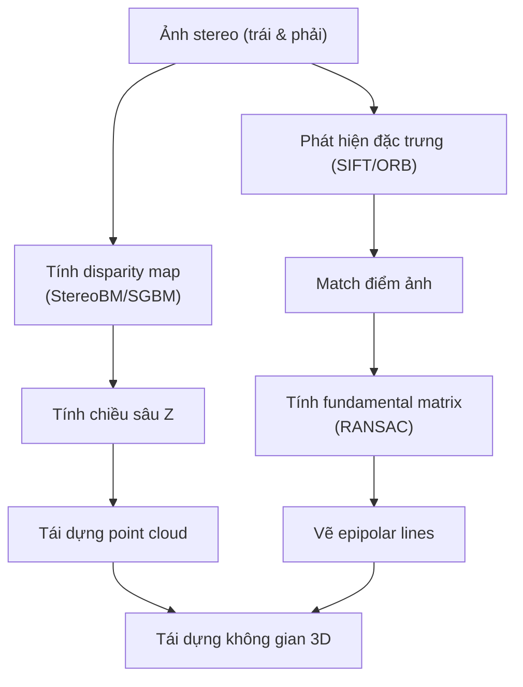

# 3D Reconstruction from Stereo Images

## Install

```sh
# tạo môi trường ảo
python -m venv venv
# source venv/bin/activate
source venv/Scripts/activate
# deactivate

# cài thư viện
pip install -r requirements.txt

# run
python filter-image.py
```

## Flow



## Kiến thức nền cần nắm

### Stereo images (ảnh stereo)

Hai ảnh của cùng một cảnh được chụp bởi hai camera hoặc một camera dịch ngang. Ví dụ: mắt trái và mắt phải nhìn một vật.

### Disparity Map (bản đồ chênh lệch)

- Mỗi pixel trong ảnh trái sẽ có một pixel tương ứng trong ảnh phải.
- Disparity là độ lệch ngang (trên trục X) giữa vị trí của cùng một điểm trong ảnh trái và phải.
- Disparity càng lớn ⇒ vật càng gần (giống nguyên lý mắt người).

Được tính bằng:
- **Block Matching**: tìm khối nhỏ giống nhau giữa 2 ảnh
- **SGBM (Semi-Global Block Matching)**: thuật toán cải tiến, mượt hơn, chính xác hơn block matching

### 3D Point Cloud (đám mây điểm 3D)

Sau khi có disparity, dùng công thức:

```math
Z = \frac{f \cdot B}{d}
```

Trong đó:
- Z: chiều sâu (depth)
- f: tiêu cự (focal length)
- B: khoảng cách 2 camera (baseline)
- d: disparity

Dựng các tọa độ (X, Y, Z) cho từng điểm ảnh, tạo thành **point cloud** – một tập hợp các điểm trong không gian 3D.

### Fundamental Matrix (ma trận cơ sở)

Là ma trận 3×3 mô tả mối liên hệ hình học giữa ảnh trái và phải.

Nếu một điểm x ở ảnh trái và x' ở ảnh phải tương ứng, thì:
```math
x'^T \cdot F \cdot x = 0
```

Dùng để tính và vẽ **epipolar lines**.

### Epipolar Lines (đường tịnh tiến)

- Cho 1 điểm trên ảnh trái, **epipolar line** là đường thẳng trên ảnh phải mà điểm tương ứng bắt buộc phải nằm trên đó.
- Ngược lại cũng đúng: từ ảnh phải → ảnh trái.

📌 Epipolar lines giúp giới hạn không gian tìm kiếm khi so khớp điểm giữa 2 ảnh.

### 📦 Deliverables (bài nộp)

| Mục cần nộp        | Ý nghĩa                                                                             |
| ------------------ | ----------------------------------------------------------------------------------- |
| **Disparity Map**  | Ảnh grayscale thể hiện độ sâu                                                       |
| **3D Point Cloud** | Tập điểm 3D, có thể hiển thị bằng Open3D hoặc Matplotlib                            |
| **Epipolar Lines** | Hai ảnh đầu vào có vẽ các đường epipolar                                            |
| **Thuật toán**     | Giải thích ngắn gọn cách tính disparity: dùng Block Matching hay SGBM? Tham số nào? |
