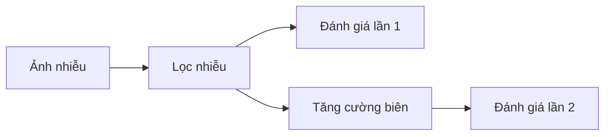

# Image Filtering (Simple)

## Install

```sh
# tạo môi trường ảo
python -m venv venv
# source venv/bin/activate
source venv/Scripts/activate
# deactivate

# cài thư viện
pip install -r requirements.txt

# run
python filter-image.py
```

## Flow



## Guideline

### PSNR (Peak Signal-to-Noise Ratio)

- Ý nghĩa: So sánh mức độ nhiễu so với tín hiệu gốc. Giá trị càng cao → ảnh càng giống ảnh gốc (ít noise hơn).
- Đơn vị: dB (decibel)
- MSE: mean squared error - sai số bình phương trung bình

📈 Cách đọc:

| PSNR (dB) | Chất lượng tái tạo          |
| --------- | --------------------------- |
| < 20      | Rất tệ (nhiễu cao)          |
| 20 – 30   | Trung bình                  |
| 30 – 40   | Tốt                         |
| > 40      | Rất tốt (gần như giống gốc) |

### SSIM (Structural Similarity Index)

- Ý nghĩa: So sánh sự tương đồng cấu trúc giữa 2 ảnh (tốt hơn MSE vì xét cả độ sáng, tương phản và cấu trúc)
- Đơn vị: không đơn vị (giá trị từ 0 đến 1)

📈 Cách đọc:

| SSIM      | Mức độ giống ảnh gốc        |
| --------- | --------------------------- |
| < 0.5     | Tệ                          |
| 0.5 – 0.7 | Chấp nhận được              |
| 0.7 – 0.9 | Tốt                         |
| > 0.9     | Rất tốt (gần như giống gốc) |

### Edge F1 Score

- Ý nghĩa: So sánh độ chính xác của các cạnh (edges) sau lọc, dựa trên bản đồ cạnh (edge map) của ảnh gốc và ảnh đã lọc (thuật toán Canny).
- Đơn vị: không đơn vị (giá trị từ 0 đến 1)

📈 Cách đọc:

| F1 Score  | Diễn giải                                                                       |
| --------- | ------------------------------------------------------------------------------- |
| ≈ 1.0     | Bộ lọc **giữ lại gần như đầy đủ** các cạnh gốc, rất tốt trong bảo toàn chi tiết |
| ≈ 0.7–0.9 | Bộ lọc **giữ khá tốt** cạnh, chấp nhận được với mức nhiễu trung bình            |
| ≈ 0.4–0.6 | Bộ lọc **làm mất nhiều cạnh**, không lý tưởng nếu chi tiết quan trọng           |
| < 0.3     | Bộ lọc **xóa mờ gần hết cạnh**, thường làm ảnh bị “flat”                        |

> Lưu ý: Chỉ số này độc lập với PSNR/SSIM vì nó chỉ tập trung vào vùng biên, nên rất hữu ích trong các bài toán như segmentation, medical imaging, edge-aware filtering.
