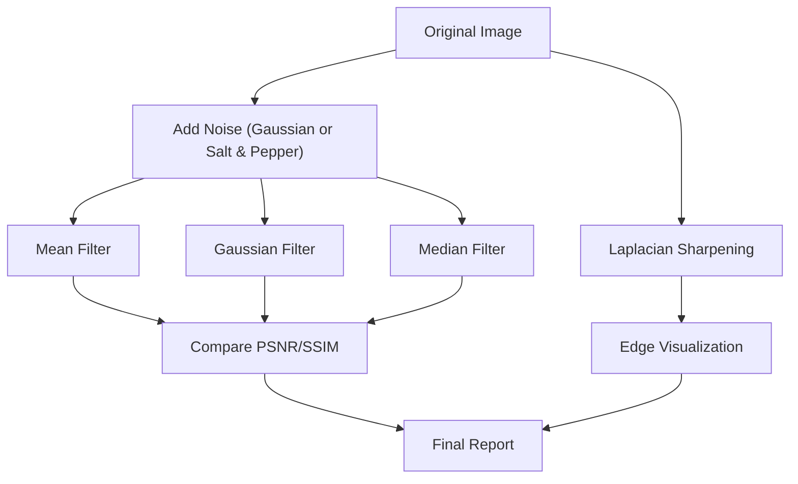

# Image Filtering

## 🧩 1. Mã nguồn và hướng dẫn cách chạy

_todo_

## 📊 2. Bảng Markdown so sánh chất lượng lọc

| Filter        | PSNR (dB) | SSIM  | Edge Preservation | Notes |
|---------------|-----------|-------|-------------------|-------|
| Mean (5x5)    | ~21.0     | ~0.70 | Kém               | Làm mượt đều, nhòe biên |
| Gaussian (5x5)| ~23.5     | ~0.78 | Trung bình        | Cân bằng tốt giữa mượt và biên |
| Median (5)    | ~25.2     | ~0.84 | Tốt               | Rất phù hợp với noise xung |
| Laplacian     | NA        | NA    | Rất rõ biên       | Làm nổi bật biên sau lọc |

## 📐 3. Mermaid Diagram – Image Filtering Pipeline

