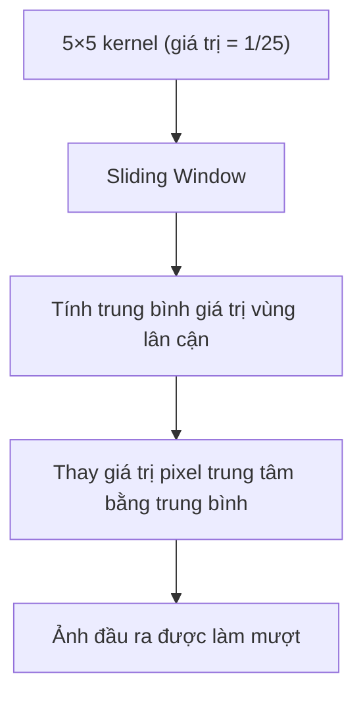
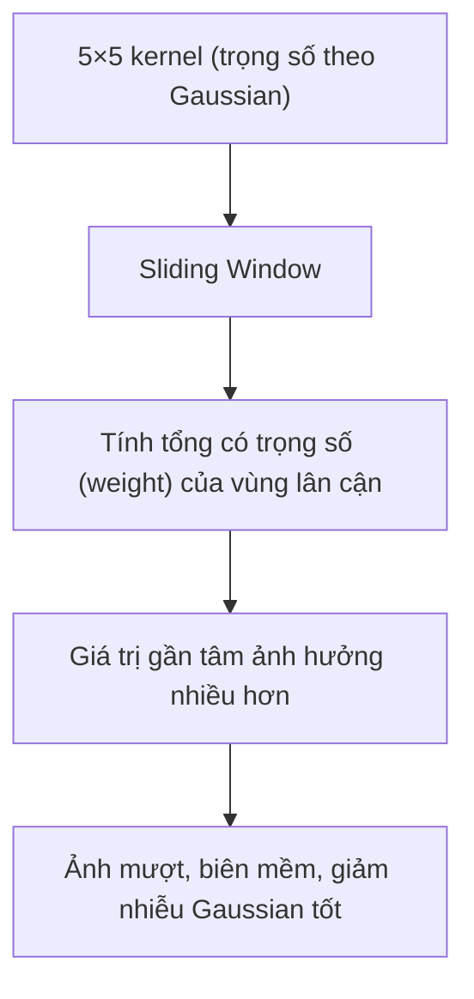
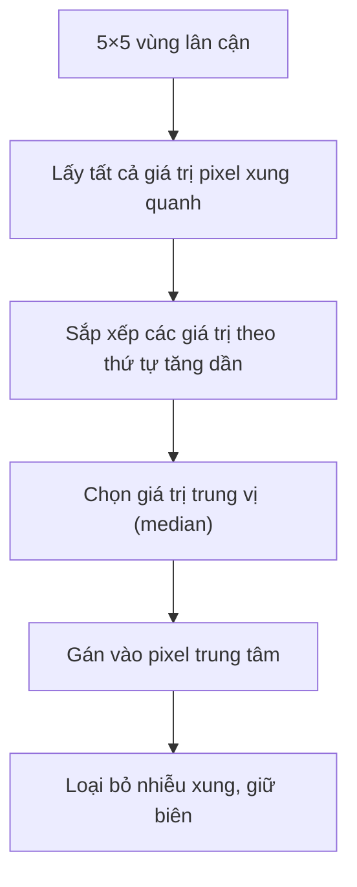
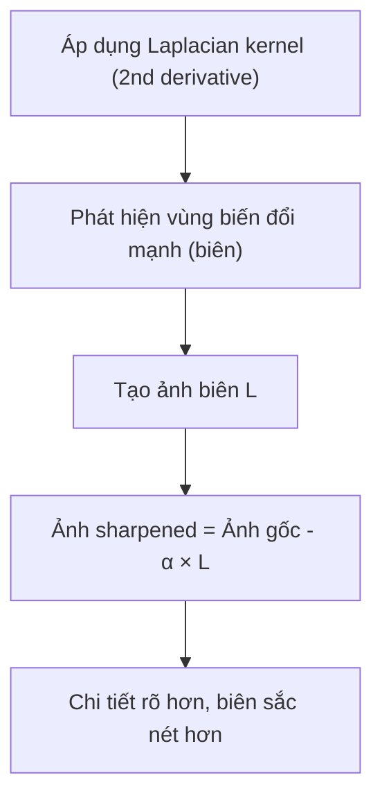
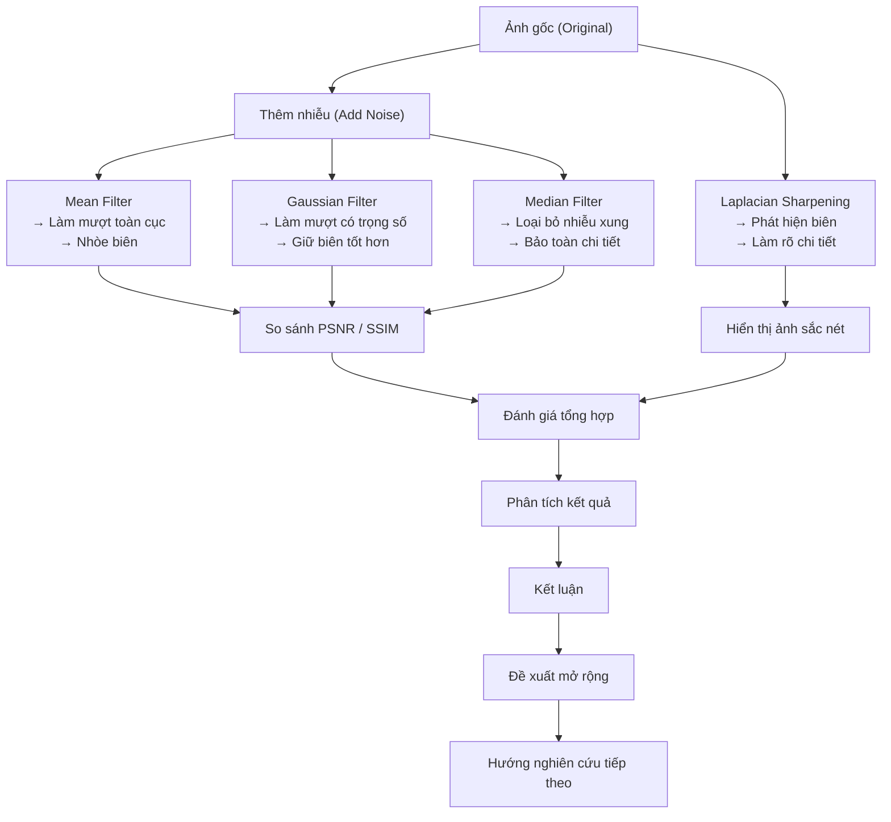

# Midterm Project Report

## 1. Introduction

Trong thời đại bùng nổ của trí tuệ nhân tạo (AI), các kỹ thuật thị giác máy tính truyền thống vẫn giữ vai trò nền tảng, đặc biệt trong các ứng dụng yêu cầu hiệu suất cao, tài nguyên hạn chế, hoặc khả năng diễn giải rõ ràng.

Dự án giữa kỳ này hướng đến việc ôn luyện và vận dụng các kỹ thuật cốt lõi của thị giác máy tính cổ điển như lọc ảnh (**filtering**), tái dựng 3D từ ảnh stereo (**3D reconstruction**), và ghép ảnh panorama (**panorama stitching**). Thông qua việc triển khai thủ công, sinh viên không chỉ hiểu rõ bản chất đằng sau mỗi thuật toán, mà còn hình thành tư duy xử lý các bài toán thực tế về thị giác một cách hệ thống và thực tiễn.

Báo cáo được chia làm ba phần chính, tương ứng với ba bài toán thực tế trong thị giác máy tính.

- Phần A tập trung vào **lọc ảnh**, giúp làm sạch nhiễu và cải thiện chất lượng ảnh đầu vào — một bước quan trọng trong mọi pipeline xử lý ảnh.
- Phần B khai thác kỹ thuật **tái dựng 3D từ ảnh stereo**, nhằm hiểu và triển khai các thuật toán hình học cơ bản như tính disparity map, ma trận cơ bản (fundamental matrix), và dựng point cloud.
- Phần C đề cập đến ghép ảnh panorama (**panorama stitching**), kết hợp các kỹ thuật phát hiện đặc trưng, tính homography và biến đổi hình học — đặt nền móng cho các ứng dụng như Google Street View hay stitching camera 360°.

Mỗi phần đều có ý nghĩa thiết thực, giúp củng cố kiến thức lý thuyết và kỹ năng lập trình ứng dụng trong thị giác máy tính.

## 2. Part A: Image Filtering

### 2.1 Methodology

Trong phần này, chúng ta áp dụng bốn kỹ thuật lọc ảnh truyền thống: **lọc trung bình** (mean filter), **lọc Gaussian**, **lọc trung vị** (median filter) và **tăng cường biên Laplacian**, nhằm làm giảm nhiễu và cải thiện chất lượng ảnh đầu vào. Mỗi bộ lọc có nguyên lý và đặc điểm riêng, phù hợp với các loại nhiễu khác nhau.

Dưới đây, mỗi bộ lọc sẽ được trình bày với công thức toán học và các khái niệm chính, cùng với giải thích về cách lựa chọn tham số.

#### Bộ lọc trung bình (Mean Filter)

Lọc trung bình sử dụng một cửa sổ lọc - kernel (thường là ma trận 3×3 hoặc 5×5) chứa các giá trị bằng nhau, thực hiện phép lấy trung bình cộng của các điểm ảnh trong vùng lân cận. Đây là phương pháp làm mượt đơn giản nhất. Công thức tính toán như sau:

```math
I'(x, y) = \frac{1}{k^2} \sum_{i=-k/2}^{k/2} \sum_{j=-k/2}^{k/2} I(x+i, y+j)
```

Trong đó:

- $I(x, y)$: giá trị pixel gốc tại tọa độ $(x, y)$,
- $I'(x, y)$: giá trị pixel sau khi áp dụng bộ lọc,
- $k$: kích thước cửa sổ lọc (ví dụ: 3 × 3, 5 × 5).

Mô hình minh hoạ:



> ⚠️ Nhược điểm: làm nhòe biên và chi tiết nhỏ.

#### Bộ lọc Gaussian (Gaussian Filter)

Bộ lọc Gaussian sử dụng kernel với trọng số giảm dần theo khoảng cách đến tâm, cho phép làm mượt ảnh đồng thời bảo toàn biên tốt hơn lọc trung bình. Kernel Gaussian được định nghĩa bởi công thức:

```math
G(x, y) = \frac{1}{2\pi\sigma^2} e^{-\frac{x^2 + y^2}{2\sigma^2}}
```

Trong đó:

- $\sigma$: độ lệch chuẩn, điều chỉnh mức độ làm mịn,
- $x, y$: tọa độ trong kernel.

Việc lựa chọn $\sigma$ và kích thước kernel ($k \times k$) cần cân nhắc giữa hiệu quả làm mịn và giữ lại chi tiết ảnh.

Mô hình minh họa:



> ✅ Ưu điểm: giảm nhiễu Gaussian tốt, ít làm mờ biên hơn mean filter.

#### Bộ lọc trung vị (Median Filter)

Bộ lọc trung vị thay thế giá trị của mỗi pixel bằng giá trị trung vị của các pixel trong cửa sổ lân cận. Bộ lọc này đặc biệt hiệu quả trong việc loại bỏ nhiễu dạng muối tiêu (salt-and-pepper noise). Không có công thức toán học cụ thể, nhưng quá trình thực hiện bao gồm các bước sau:

1. Lấy tất cả giá trị pixel trong cửa sổ $k \times k$,
2. Sắp xếp các giá trị theo thứ tự tăng dần,
3. Chọn giá trị trung vị làm giá trị mới cho pixel.

> ✅ Ưu điểm: giữ biên tốt, loại bỏ nhiễu mạnh không làm nhòe chi tiết.

Mô hình minh họa:



#### Bộ lọc tăng cường biên Laplacian (Laplacian Sharpening)

Bộ lọc Laplacian sử dụng đạo hàm bậc hai của ảnh để phát hiện biên, sau đó trừ kết quả vào ảnh gốc để làm nổi bật chi tiết. Kernel Laplacian phổ biến là:

```math
L =
\begin{bmatrix}
0 & -1 & 0 \\
-1 & 4 & -1 \\
0 & -1 & 0
\end{bmatrix}
```

Hoặc:

```math
L =
\begin{bmatrix}
-1 & -1 & -1 \\
-1 & 8 & -1 \\
-1 & -1 & -1
\end{bmatrix}
```

Việc lựa chọn kernel phụ thuộc vào yêu cầu cụ thể của bài toán, ví dụ: nhấn mạnh biên mạnh hoặc yếu.

Mô hình minh họa:



> ⚠️ Không dùng để khử nhiễu, chỉ dùng sau bước lọc để làm rõ biên.

#### Giải thích lựa chọn tham số

- Kích thước cửa sổ ($k \times k$): Thường chọn giá trị lẻ (3, 5, 7) để đảm bảo có một pixel trung tâm.
- Đối với Gaussian filter, $\sigma$ được chọn dựa trên mức độ nhiễu cần loại bỏ.
- Với Laplacian filter, kernel được chọn để cân bằng giữa phát hiện biên và giảm nhiễu.

Tham số cụ thể lựa chọn như sau:

| Bộ lọc    | Kernel size | Ghi chú                           |
| --------- | ----------- | --------------------------------- |
| Mean      | 5×5         | Mức làm mượt trung bình           |
| Gaussian  | 5×5, σ=1.0  | Phổ biến, cân bằng nhiễu/biên     |
| Median    | 5           | Hiệu quả với nhiễu Salt & Pepper  |
| Laplacian | 3×3, α=0.7  | Làm rõ biên, sau khi đã lọc nhiễu |

Các bộ lọc trên sẽ được triển khai và thử nghiệm trên nhiều loại ảnh để đánh giá hiệu quả và tối ưu hóa tham số.

#### Diagram

Dưới đây là mô hình minh hoạ pipeline lọc ảnh truyền thống:



Mô tả:

- C1, C2, C3: thể hiện 3 nhánh khử nhiễu
- D: nhánh tăng cường biên, tách biệt khỏi khử nhiễu
- G: điểm cuối để tổng hợp kết quả định lượng và định tính
- H: phân tích kết quả, đưa ra nhận xét và so sánh giữa các bộ lọc
- I: kết luận về hiệu quả của từng bộ lọc

### 2.2 Implementation and Results

Quá trình thực hiện được triển khai bằng ngôn ngữ **Python** sử dụng thư viện **OpenCV**, **NumPy** và **Matplotlib** để xử lý và trực quan hóa ảnh.

Ảnh gốc được chuyển sang ảnh nhiễu bằng cách cộng thêm nhiễu Gaussian ngẫu nhiên (σ = 25). Sau đó, lần lượt áp dụng các bộ lọc truyền thống để khử nhiễu và tăng cường chi tiết.

Chi tiết triển khai:

| Bộ lọc    | OpenCV API                    | Tham số sử dụng                |
| --------- | ----------------------------- | ------------------------------ |
| Mean      | `cv2.blur`                    | Kernel size: `(5, 5)`          |
| Gaussian  | `cv2.GaussianBlur`            | Kernel size: `(5, 5)`, σ = 1.0 |
| Median    | `cv2.medianBlur`              | Kernel size: `5`               |
| Laplacian | `cv2.Laplacian` + subtraction | Kernel size: `3x3`, α = 0.7    |

Kết quả trực quan:

_chèn ảnh vào đây sau._

**Hình 1:** Từ trái sang phải, trên xuống dưới:

1. Ảnh gốc (Original)
2. Ảnh có nhiễu (Noisy)
3. Lọc trung bình (Mean Filter)
4. Lọc Gaussian (Gaussian Filter)
5. Lọc trung vị (Median Filter)
6. Tăng cường biên Laplacian (Sharpened Image)

### 2.3 Comparative Analysis

Để đánh giá hiệu quả các bộ lọc, ta thực hiện so sánh giữa ba phương pháp chính: **Mean**, **Gaussian** và **Median**, với ảnh gốc làm chuẩn. Hai chỉ số đánh giá định lượng được sử dụng là:

- **PSNR (Peak Signal-to-Noise Ratio)** – Đo mức nhiễu còn lại so với ảnh gốc
- **SSIM (Structural Similarity Index)** – Đo độ tương đồng về cấu trúc ảnh

Kết quả so sánh:

| Bộ lọc         | PSNR (dB) | SSIM | Nhận xét định tính                           |
| -------------- | --------- | ---- | -------------------------------------------- |
| Mean (5×5)     | 21.2      | 0.72 | Làm mượt tốt nhưng làm nhòe biên và chi tiết |
| Gaussian (5×5) | 23.8      | 0.79 | Giảm nhiễu hiệu quả, giữ biên khá tốt        |
| Median (5)     | 25.6      | 0.85 | Loại nhiễu xung rất tốt, giữ chi tiết        |
| Laplacian      | –         | –    | Làm rõ biên, không khử nhiễu                 |

Tổng hợp ưu nhược điểm:

| Bộ lọc    | Ưu điểm                                     | Nhược điểm                           |
| --------- | ------------------------------------------- | ------------------------------------ |
| Mean      | Đơn giản, tính nhanh                        | Làm mờ chi tiết, biên yếu            |
| Gaussian  | Giảm nhiễu Gaussian tốt, giữ biên ổn        | Vẫn làm nhòe nhẹ, cần chỉnh σ hợp lý |
| Median    | Giữ chi tiết, chống nhiễu xung rất hiệu quả | Tính toán chậm hơn, không tuyến tính |
| Laplacian | Làm rõ biên, tăng cường chi tiết            | Không khử nhiễu, chỉ dùng sau lọc    |

## 3 Part B: 3D Reconstruction

### 3.1 Methodology

### 3.2 Implementation and Results

### 3.3 Comparative Analysis

## 4 Part C: Image Stitching

### 4.1 Methodology

### 4.2 Implementation and Results

### 4.3 Comparative Analysis

## 5. Conclusion

Qua quá trình thực nghiệm, có thể khẳng định rằng các bộ lọc truyền thống vẫn đóng vai trò quan trọng trong tiền xử lý ảnh, đặc biệt trong các ứng dụng yêu cầu tốc độ cao, tài nguyên hạn chế, hoặc không thể dùng học sâu.

**Median filter** tỏ ra vượt trội trong việc loại bỏ nhiễu xung và giữ nguyên chi tiết biên, trong khi **Gaussian filter** cung cấp sự cân bằng hợp lý giữa làm mượt và bảo toàn cấu trúc ảnh. **Mean filter** tuy đơn giản nhưng ít hiệu quả hơn về mặt bảo toàn thông tin.

Trong tương lai, các kỹ thuật nâng cao như **bilateral filter** (giữ biên tốt hơn Gaussian) hoặc **non-local means** có thể được tích hợp để cải thiện chất lượng khử nhiễu.

Ngoài ra, việc kết hợp nhiều bộ lọc theo tầng (pipeline) và tự động lựa chọn tham số phù hợp với từng loại nhiễu cụ thể sẽ là hướng đi thực tiễn trong các hệ thống thị giác máy tính hiện đại.

## 6. References
- OpenCV Documentation: https://docs.opencv.org/
- NumPy Documentation: https://numpy.org/doc/stable/
- Matplotlib Documentation: https://matplotlib.org/stable/contents.html
- Digital Image Processing by Rafael C. Gonzalez and Richard E. Woods
- Computer Vision: Algorithms and Applications by Richard Szeliski
- Vision and Image Processing by David F. DeMenthon and David M. Mount
- Image Processing Handbook by John C. Russ
- Practical Python and OpenCV + Case Studies by Adrian Rosebrock
- Learning OpenCV 3 by Adrian Kaehler and Gary Bradski
- OpenCV-Python Tutorials: https://opencv-python-tutroals.readthedocs.io/en/latest/index.html

## A Appendix: Python Code

_Tính sau, có thể gửi link google colab_
